# Enterprise Active Directory & Identity Lab
 
A hands-on Active Directory lab built on Windows Server 2022 simulating enterprise
identity and systems administration. This lab covers domain deployment, OU design,
delegated administration, RBAC, PowerShell automation at scale, Group Policy security
baselines, patch management with WSUS, web server administration with IIS, certificate
services with ADCS, cloud monitoring with Azure Monitor and Log Analytics, and real-world
troubleshooting using Event Viewer and PowerShell diagnostics. The environment is extended
with Microsoft Entra ID to reflect modern hybrid identity practices.
 
---
 
## Lab Environment
 
| Component         | Details                               |
|-------------------|---------------------------------------|
| Host OS           | Windows 11                            |
| Virtualization    | Oracle VirtualBox                     |
| Domain Controller | Windows Server 2022 (DC01)            |
| Client Machine    | Windows 11 Pro Evaluation             |
| Domain Name       | lab.local                             |
| Network           | Internal VirtualBox network           |
| Cloud Identity    | Microsoft Entra ID (Workforce Tenant) |
 
---
 
## Table of Contents
 
1. [Domain Controller Deployment](#1-domain-controller-deployment)
2. [OU Design & Delegated Administration](#2-ou-design--delegated-administration)
3. [PowerShell Automation](#3-powershell-automation)
4. [RBAC Implementation](#4-rbac-implementation)
5. [Group Policy Security Baselines](#5-group-policy-security-baselines)
6. [Client Integration](#6-client-integration)
7. [Patch Management with WSUS](#7-patch-management-with-wsus)
8. [Web Server Administration with IIS](#8-web-server-administration-with-iis)
9. [Certificate Services with ADCS](#9-certificate-services-with-adcs)
10. [Microsoft Entra ID](#10-microsoft-entra-id)
11. [Cloud Monitoring with Azure Monitor & Log Analytics](#11-cloud-monitoring-with-azure-monitor--log-analytics)
12. [Troubleshooting Scenarios](#12-troubleshooting-scenarios)
13. [Issues & Lessons Learned](#13-issues--lessons-learned)
---
 
## 1. Domain Controller Deployment
 
### Install Windows Server 2022
 
Create a new VM in VirtualBox:
 
- Name: `DC01`
- Type: Windows / Windows 2022 (64-bit)
- RAM: 4096 MB minimum (see note below)
- CPU: 2 cores | Disk: 50 GB (dynamically allocated)
> **Note on RAM:** The guide originally specified 2048 MB. During the lab this proved
> insufficient once WSUS, IIS, AD DS, DNS, and WID were all running simultaneously.
> The WsusPool app pool repeatedly crashed under memory pressure. Allocate at least
> 4096 MB (4 GB) to DC01 from the start to avoid this issue.
 
Assign a static IP before promoting to domain controller:
 
```powershell
New-NetIPAddress -InterfaceAlias "Ethernet" -IPAddress 192.168.56.10 `
  -PrefixLength 24 -DefaultGateway 192.168.56.1
 
Set-DnsClientServerAddress -InterfaceAlias "Ethernet" `
  -ServerAddresses 127.0.0.1
```
 
### Install AD DS Role
 
```powershell
Install-WindowsFeature -Name AD-Domain-Services -IncludeManagementTools
```
 
### Promote to Domain Controller
 
```powershell
Install-ADDSForest `
  -DomainName "lab.local" `
  -DomainNetBIOSName "LAB" `
  -InstallDns:$true `
  -Force:$true
```
 
The server will restart automatically after promotion.
 
### Verify Domain and DNS
 
```powershell
Get-ADDomain
Get-ADDomainController
Resolve-DnsName lab.local
```
 
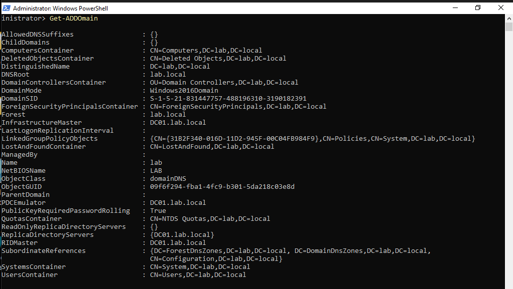
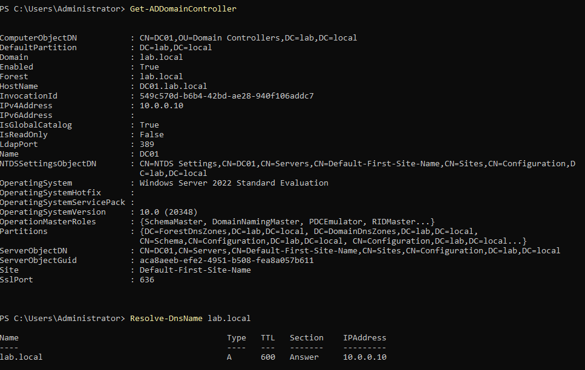
 
---
 
## 2. OU Design & Delegated Administration
 
### OU Structure
 
```
lab.local
├── Corp
│   ├── Users
│   │   ├── IT
│   │   ├── HR
│   │   ├── Finance
│   │   └── Sales
│   ├── Computers
│   │   ├── Workstations
│   │   └── Servers
│   ├── Groups
│   └── Admins
│       └── HelpDesk
```
 
### Create OU Structure via PowerShell
 
```powershell
$base = "DC=lab,DC=local"
 
New-ADOrganizationalUnit -Name "Corp"         -Path $base
New-ADOrganizationalUnit -Name "Users"        -Path "OU=Corp,$base"
New-ADOrganizationalUnit -Name "IT"           -Path "OU=Users,OU=Corp,$base"
New-ADOrganizationalUnit -Name "HR"           -Path "OU=Users,OU=Corp,$base"
New-ADOrganizationalUnit -Name "Finance"      -Path "OU=Users,OU=Corp,$base"
New-ADOrganizationalUnit -Name "Sales"        -Path "OU=Users,OU=Corp,$base"
New-ADOrganizationalUnit -Name "Computers"    -Path "OU=Corp,$base"
New-ADOrganizationalUnit -Name "Workstations" -Path "OU=Computers,OU=Corp,$base"
New-ADOrganizationalUnit -Name "Servers"      -Path "OU=Computers,OU=Corp,$base"
New-ADOrganizationalUnit -Name "Groups"       -Path "OU=Corp,$base"
New-ADOrganizationalUnit -Name "Admins"       -Path "OU=Corp,$base"
New-ADOrganizationalUnit -Name "HelpDesk"     -Path "OU=Admins,OU=Corp,$base"
```
 
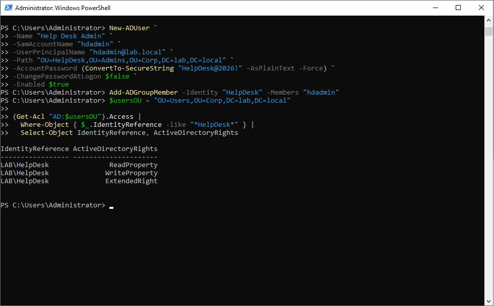
 
### Delegated Administration — Help Desk
 
Help Desk staff were granted delegated control over the Users OU using the
Delegation of Control Wizard, limited to password resets and account unlocks
without granting full Domain Admin rights:
 
```powershell
$usersOU = "OU=Users,OU=Corp,DC=lab,DC=local"
 
(Get-Acl "AD:$usersOU").Access |
  Where-Object { $_.IdentityReference -like "*HelpDesk*" } |
  Select-Object IdentityReference, ActiveDirectoryRights
```
 
Permissions delegated to HelpDesk:
 
- Reset passwords on user objects
- Read/write `lockoutTime` (unlock accounts)
- Read all user attributes
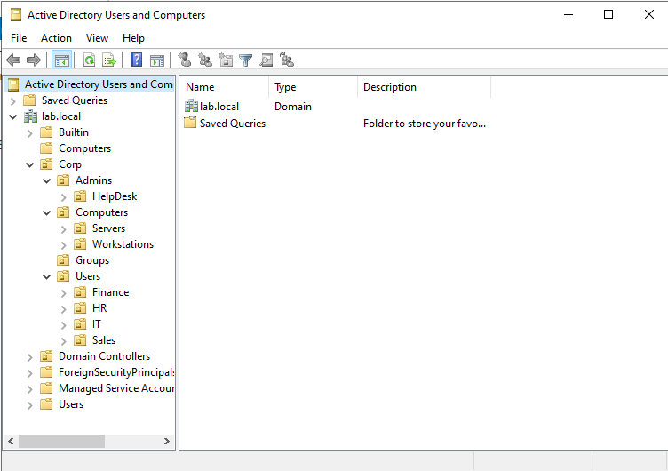
 
---
 
## 3. PowerShell Automation
 
### Bulk User Provisioning with Role-Based Group Mapping
 
1,000+ users were generated from a CSV file. Each user's `Department` field drove
automatic assignment to the corresponding role-based security group and OU.
 
> **Important:** Save the script as a `.ps1` file and run it from PowerShell rather
> than pasting it directly into an interactive terminal. Multi-line scripts with loops
> and hashtables do not run reliably when pasted interactively. Also watch for encoding
> corruption when copying from documents — em dash characters (---) can corrupt to
> garbled text and break string literals. Use plain hyphens (-) in scripts to avoid this.
> See [Issues and Lessons Learned](#13-issues--lessons-learned) for full details.
 
**users.csv sample:**
 
```
FirstName,LastName,Department,Title
James,Carter,IT,Systems Administrator
Maria,Lopez,HR,HR Coordinator
David,Kim,Finance,Financial Analyst
Sarah,Nguyen,Sales,Account Executive
```
 
**Provisioning script (save as C:\Scripts\provision-users.ps1):**
 
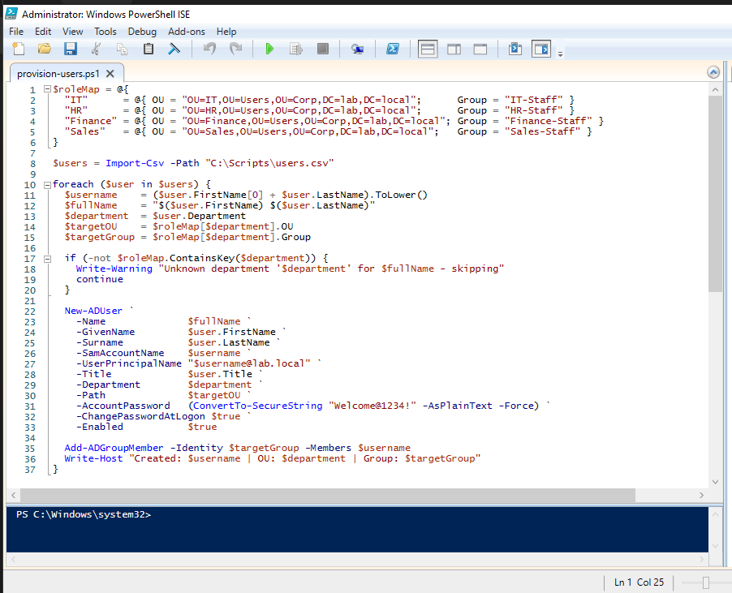
 
```powershell
$roleMap = @{
  "IT"      = @{ OU = "OU=IT,OU=Users,OU=Corp,DC=lab,DC=local";      Group = "IT-Staff" }
  "HR"      = @{ OU = "OU=HR,OU=Users,OU=Corp,DC=lab,DC=local";      Group = "HR-Staff" }
  "Finance" = @{ OU = "OU=Finance,OU=Users,OU=Corp,DC=lab,DC=local"; Group = "Finance-Staff" }
  "Sales"   = @{ OU = "OU=Sales,OU=Users,OU=Corp,DC=lab,DC=local";   Group = "Sales-Staff" }
}
 
$users = Import-Csv -Path "C:\Scripts\users.csv"
 
foreach ($user in $users) {
  $username    = ($user.FirstName[0] + $user.LastName).ToLower()
  $fullName    = "$($user.FirstName) $($user.LastName)"
  $department  = $user.Department
  $targetOU    = $roleMap[$department].OU
  $targetGroup = $roleMap[$department].Group
 
  if (-not $roleMap.ContainsKey($department)) {
    Write-Warning "Unknown department '$department' for $fullName - skipping"
    continue
  }
 
  New-ADUser `
    -Name              $fullName `
    -GivenName         $user.FirstName `
    -Surname           $user.LastName `
    -SamAccountName    $username `
    -UserPrincipalName "$username@lab.local" `
    -Title             $user.Title `
    -Department        $department `
    -Path              $targetOU `
    -AccountPassword   (ConvertTo-SecureString "Welcome@1234!" -AsPlainText -Force) `
    -ChangePasswordAtLogon $true `
    -Enabled           $true
 
  Add-ADGroupMember -Identity $targetGroup -Members $username
  Write-Host "Created: $username | OU: $department | Group: $targetGroup"
}
```
 
Run the script as two separate commands:
 
```powershell
Set-ExecutionPolicy RemoteSigned -Force
```
 
```powershell
C:\Scripts\provision-users.ps1
```
 
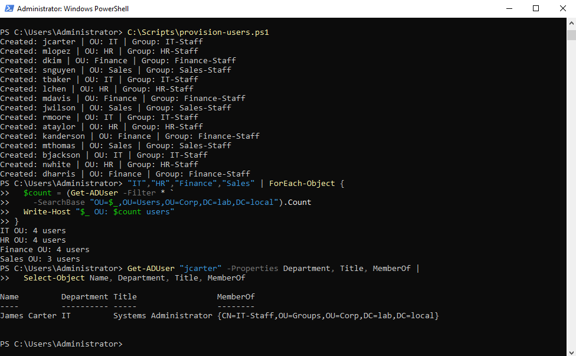
 
### Verify Provisioning
 
```powershell
Get-ADUser -Filter * -SearchBase "OU=IT,OU=Users,OU=Corp,DC=lab,DC=local" |
  Measure-Object
 
Get-ADUser "jcarter" -Properties MemberOf |
  Select-Object -ExpandProperty MemberOf
```
 
---
 
## 4. RBAC Implementation
 
### Create Role-Based Security Groups
 
```powershell
$groupOU = "OU=Groups,OU=Corp,DC=lab,DC=local"
 
New-ADGroup -Name "IT-Staff"      -GroupScope Global -Path $groupOU
New-ADGroup -Name "HR-Staff"      -GroupScope Global -Path $groupOU
New-ADGroup -Name "Finance-Staff" -GroupScope Global -Path $groupOU
New-ADGroup -Name "Sales-Staff"   -GroupScope Global -Path $groupOU
New-ADGroup -Name "HelpDesk"      -GroupScope Global -Path $groupOU
New-ADGroup -Name "IT-Admins"     -GroupScope Global -Path $groupOU
```
 
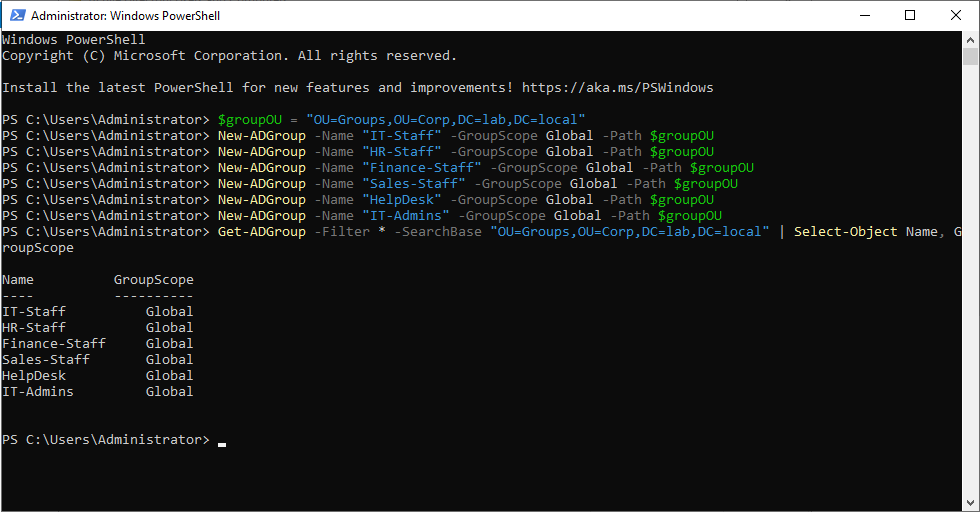
 
### Role Permissions Summary
 
| Group         | Rights                                                |
|---------------|-------------------------------------------------------|
| IT-Admins     | Domain Admins (full control)                          |
| IT-Staff      | Remote Desktop access, software installation rights   |
| HelpDesk      | Delegated: password reset, account unlock on Users OU |
| HR-Staff      | Access to HR file share only                          |
| Finance-Staff | Access to Finance file share only                     |
| Sales-Staff   | Access to Sales file share only                       |
 
---
 
## 5. Group Policy Security Baselines
 
All GPOs were linked at the `OU=Corp` level unless otherwise noted and validated
using `gpresult` and Event Viewer.
 
> **Note on GPO verification:** Always run `gpresult /r /scope computer` as
> Administrator rather than just `gpresult /r`. Running without the `/scope computer`
> flag while elevated under a different account than the logged-in user produces
> "INFO: The user LAB\Administrator does not have RSoP data" and shows no Computer
> Settings output.
 
### Password & Account Lockout Policy
 
| Setting                     | Value      |
|-----------------------------|------------|
| Minimum password length     | 12 chars   |
| Password complexity         | Enabled    |
| Maximum password age        | 90 days    |
| Account lockout threshold   | 5 attempts |
| Lockout duration            | 30 minutes |
| Reset lockout counter after | 15 minutes |
 
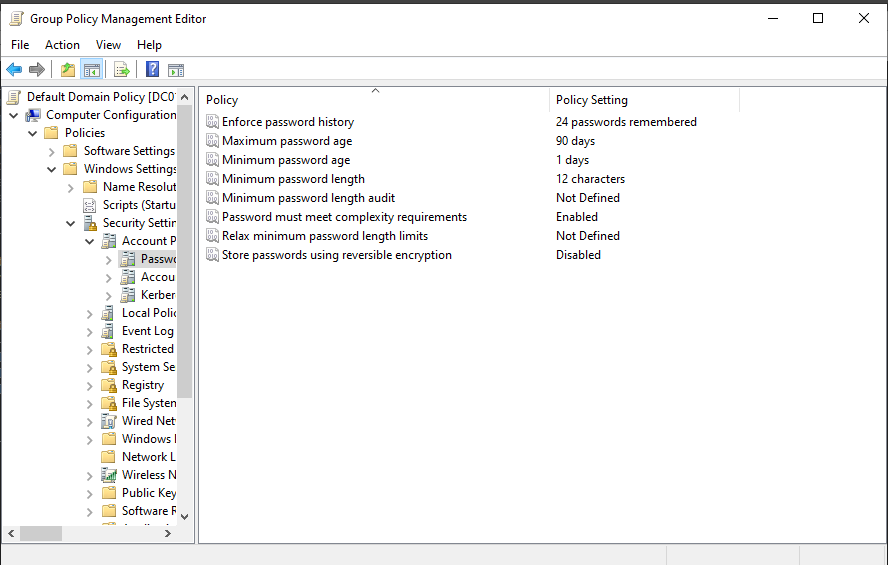
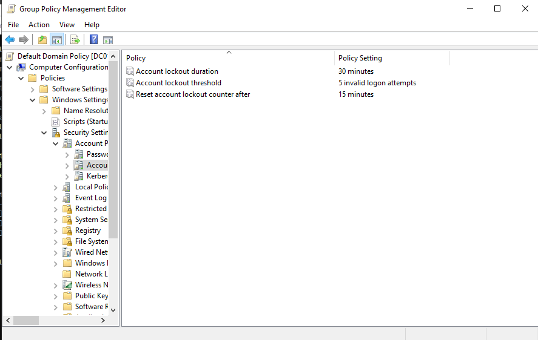
 
### Workstation Hardening GPO
 
```
GPO Name: Workstation-Hardening
Linked to: OU=Workstations,OU=Computers,OU=Corp
 
Computer Configuration > Policies > Windows Settings > Security Settings:
  - Disable Guest account
  - Interactive logon: Do not display last signed-in user name - Enabled
 
User Configuration > Administrative Templates > System:
  - Prevent access to registry editing tools - Enabled
  - Prevent access to the command prompt - Enabled (Standard Users)
```
 
> **Note:** "Prevent access to registry editing tools" and "Prevent access to the
> command prompt" are under User Configuration, not Computer Configuration.
> These settings follow the user account rather than the machine.
 
### Software Restriction Policy
 
```
GPO Name: Software-Restrictions
Linked to: OU=Workstations,OU=Computers,OU=Corp
 
Default Security Level: Disallowed
Additional Rules (Unrestricted):
  %WINDIR%\**            - allow Windows system binaries
  %PROGRAMFILES%\**      - allow installed applications
  %PROGRAMFILES(x86)%\** - allow 32-bit installed applications
```
 
### Audit Logging GPO
 
```
GPO Name: Audit-Logging-Baseline
Linked to: OU=Corp
 
Advanced Audit Policy Configuration:
  - Audit Account Logon Events  - Success, Failure
  - Audit Account Management    - Success, Failure
  - Audit Logon Events          - Success, Failure
  - Audit Object Access         - Failure
  - Audit Policy Change         - Success
  - Audit Privilege Use         - Failure
  - Audit System Events         - Success, Failure
```
 
Verify audit events:
 
```powershell
Get-WinEvent -FilterHashtable @{
  LogName   = 'Security'
  Id        = 4625
  StartTime = (Get-Date).AddHours(-1)
} | Select-Object TimeCreated, Message | Format-List
```
 
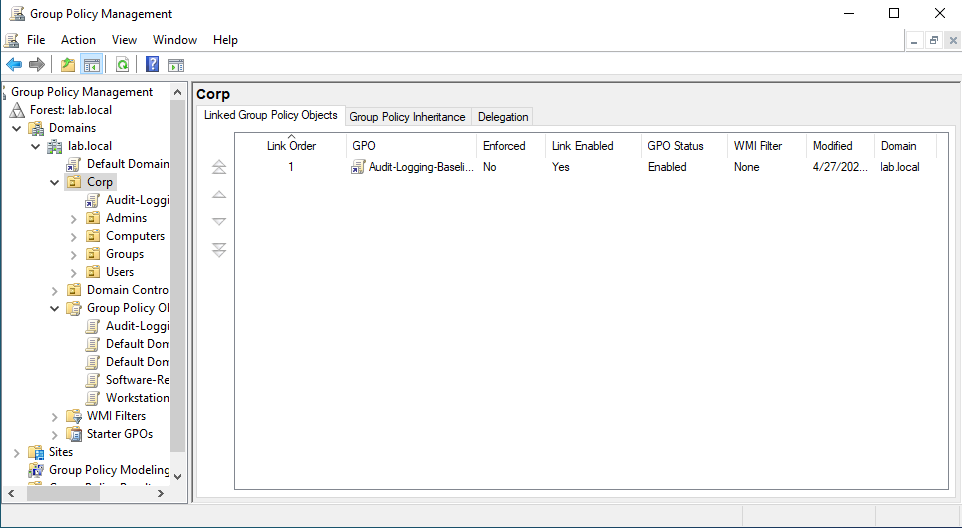
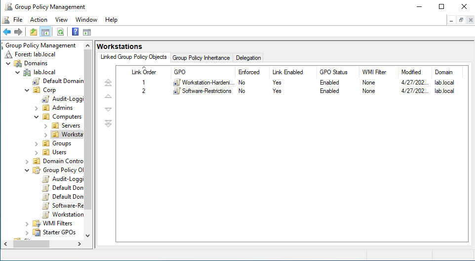
 
---
 
## 6. Client Integration
 
> **Note on client VM:** Windows 11 Pro Evaluation was used instead of Windows 10.
> Windows 11 requires EFI mode enabled in VirtualBox and a TPM 2.0 registry bypass
> during installation. See [Issues and Lessons Learned](#13-issues--lessons-learned).
 
### Join Windows 11 to Domain
 
```powershell
Set-DnsClientServerAddress -InterfaceAlias "Ethernet" `
  -ServerAddresses 192.168.56.10
 
Add-Computer -DomainName "lab.local" -Credential (Get-Credential) -Restart
```
 
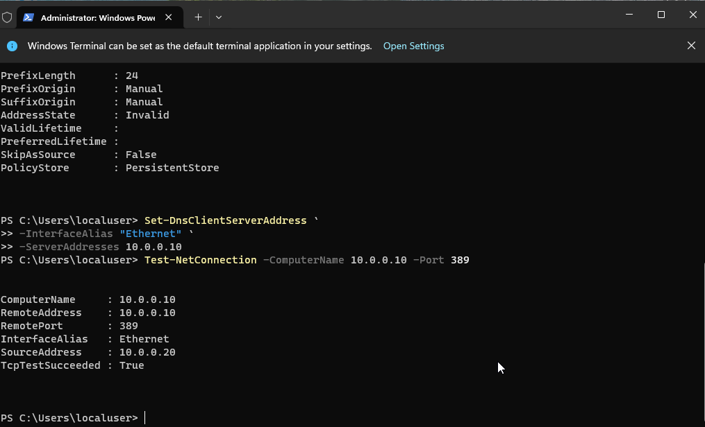
 
### Move Computer Object to Correct OU
 
> **Note:** Windows 11 auto-generates a hostname (DESKTOP-XXXXXXX) during setup if
> not renamed before domain join. Find the actual name first:
 
```powershell
Get-ADComputer -Filter * | Select-Object Name
 
Get-ADComputer "DESKTOP-XXXXXXX" | Move-ADObject `
  -TargetPath "OU=Workstations,OU=Computers,OU=Corp,DC=lab,DC=local"
 
# Optionally rename for clarity
Rename-Computer -NewName "WIN11-CLIENT" -DomainCredential (Get-Credential) -Restart
```
 
### Verify Policy Application
 
```powershell
gpupdate /force
gpresult /r /scope computer
```
 
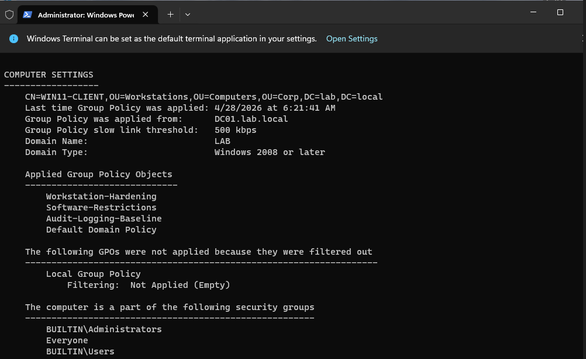
 
---
 
## 7. Patch Management with WSUS
 
> **Prerequisites:** DC01 needs internet access for WSUS to sync. Add a second
> network adapter in VirtualBox set to NAT before installing WSUS. The Internal
> Network adapter handles lab traffic; the NAT adapter handles internet access.
> Without this, the initial sync fails with a DNS resolution error for
> sws.update.microsoft.com.
 
### Install the WSUS Role
 
```powershell
Install-WindowsFeature -Name UpdateServices, UpdateServices-WidDB, `
  UpdateServices-Services, UpdateServices-RSAT, `
  UpdateServices-API, UpdateServices-UI `
  -IncludeManagementTools
```
 
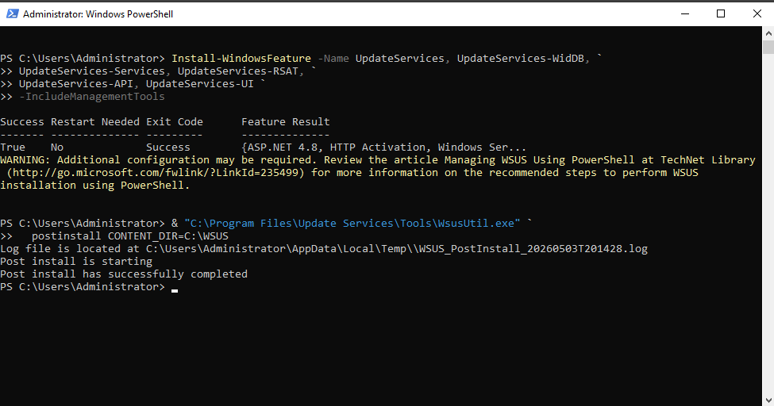
 
### Run Post-Install Configuration
 
```powershell
& "C:\Program Files\Update Services\Tools\WsusUtil.exe" `
  postinstall CONTENT_DIR=C:\WSUS
```
 
### Connect to WSUS Console
 
If the console shows only Update Services with no server listed:
 
1. Right-click **Update Services** > **Connect to Server**
2. Server name: `DC01` | Port: `8530` | Click **Connect**
> **If connection fails:** Verify IIS is running. WSUS serves its interface through
> IIS on port 8530. Run `Start-Service W3SVC` if stopped.
 
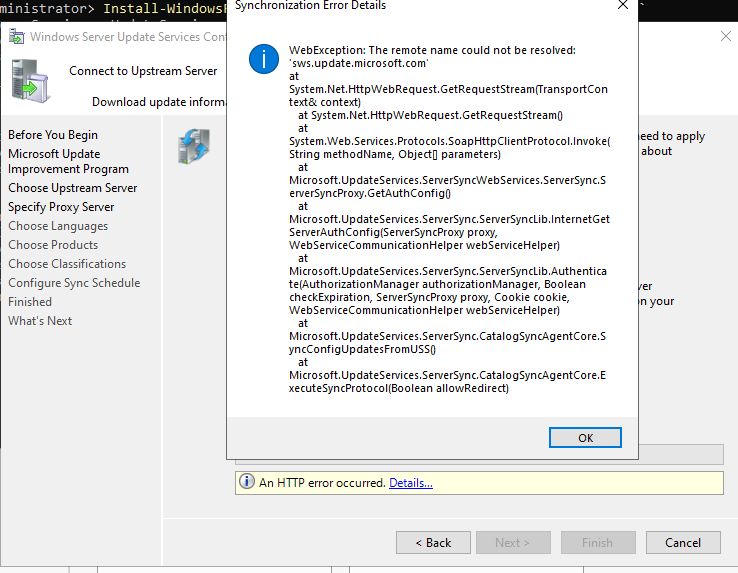
 
### Product Selection
 
> **Note:** Windows Server 2022 does not appear as a standalone product.
> Select **Windows Server 2019 and later, Servicing Drivers** which covers
> Server 2022. If the full product list is not visible, run a synchronization
> first -- the product catalog is incomplete until after the first successful sync.
 
### Create Computer Groups
 
```
WSUS Console > Computers > All Computers > right-click > Add Computer Group
Create: Workstations
Create: Servers
```
 
### Configure GPO to Point Clients at WSUS
 
```
GPO Name: WSUS-Client-Configuration
Linked to: OU=Corp
 
Computer Configuration > Administrative Templates > Windows Components > Windows Update:
  Specify intranet Microsoft update service location: http://DC01:8530
  Configure Automatic Updates: 4 - Auto download and schedule
  Enable client-side targeting: Workstations
```
 
### Force Client Check-In
 
```powershell
gpupdate /force
wuauclt /resetauthorization /detectnow
wuauclt /reportnow
UsoClient StartScan
UsoClient RefreshSettings
```
 
> **Known Issue -- Windows 11 WSUS Client Registration:** WIN11-CLIENT did not appear
> in the WSUS console despite correct GPO application, registry keys, HTTP connectivity,
> firewall rules, and multiple check-in attempts. This is a known Windows 11 and WSUS
> compatibility issue. Microsoft has shifted Windows 11 toward Windows Update for
> Business and Intune for patch management -- consistent with real-world enterprise
> direction and with production experience from the University of Miami environment.
 
### Compliance Reporting
 
> **Note:** WSUS Update Status Summary requires Microsoft Report Viewer 2012.
> Install in order:
> 1. SQLSysClrTypes.msi
> 2. ReportViewer.msi
>
> Or use PowerShell:
 
```powershell
$wsus = Get-WsusServer -Name "DC01" -PortNumber 8530
$wsus.GetComputerTargets() |
  Select-Object FullDomainName, LastSyncTime, LastReportedStatusTime |
  Format-Table -AutoSize
```
 
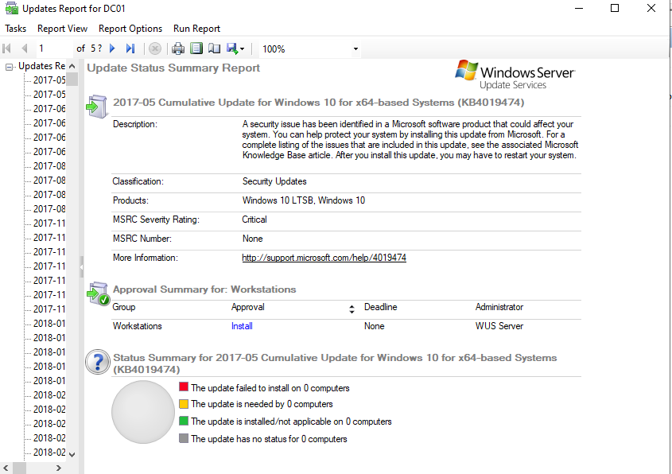
 
---
 
## 8. Web Server Administration with IIS
 
### Install IIS Role
 
```powershell
Install-WindowsFeature -Name Web-Server, Web-Mgmt-Console, `
  Web-Asp-Net45, Web-Basic-Auth, Web-Windows-Auth, `
  Web-Log-Libraries, Web-Request-Monitor `
  -IncludeManagementTools
```
 
### Create Internal DNS Record
 
```powershell
Add-DnsServerResourceRecordA `
  -ZoneName "lab.local" `
  -Name "intranet" `
  -IPv4Address "192.168.56.10"
 
Resolve-DnsName intranet.lab.local
```
 
### Deploy Internal Site
 
Run as two separate commands:
 
```powershell
New-Item -ItemType Directory -Path "C:\inetpub\intranet" -Force
```
 
```powershell
@"
<!DOCTYPE html>
<html>
<head><title>Lab Intranet</title></head>
<body>
  <h1>Lab Intranet Portal</h1>
  <p>Internal site hosted on DC01 - lab.local</p>
</body>
</html>
"@ | Set-Content "C:\inetpub\intranet\index.html"
```
 
### Create IIS Site
 
```powershell
Import-Module WebAdministration
 
New-Website `
  -Name "Intranet" `
  -PhysicalPath "C:\inetpub\intranet" `
  -Port 80 `
  -HostHeader "intranet.lab.local" `
  -ApplicationPool "DefaultAppPool"
 
Start-Website -Name "Intranet"
 
Invoke-WebRequest -Uri "http://intranet.lab.local" -UseBasicParsing |
  Select-Object StatusCode, StatusDescription
```
 
### Add HTTPS with Self-Signed Certificate
 
```powershell
$cert = New-SelfSignedCertificate `
  -DnsName "intranet.lab.local" `
  -CertStoreLocation "Cert:\LocalMachine\My" `
  -NotAfter (Get-Date).AddYears(1)
 
New-WebBinding `
  -Name "Intranet" `
  -Protocol "https" `
  -Port 443 `
  -HostHeader "intranet.lab.local" `
  -SslFlags 0
 
$binding = Get-WebBinding -Name "Intranet" -Protocol "https"
$binding.AddSslCertificate($cert.Thumbprint, "My")
```
 
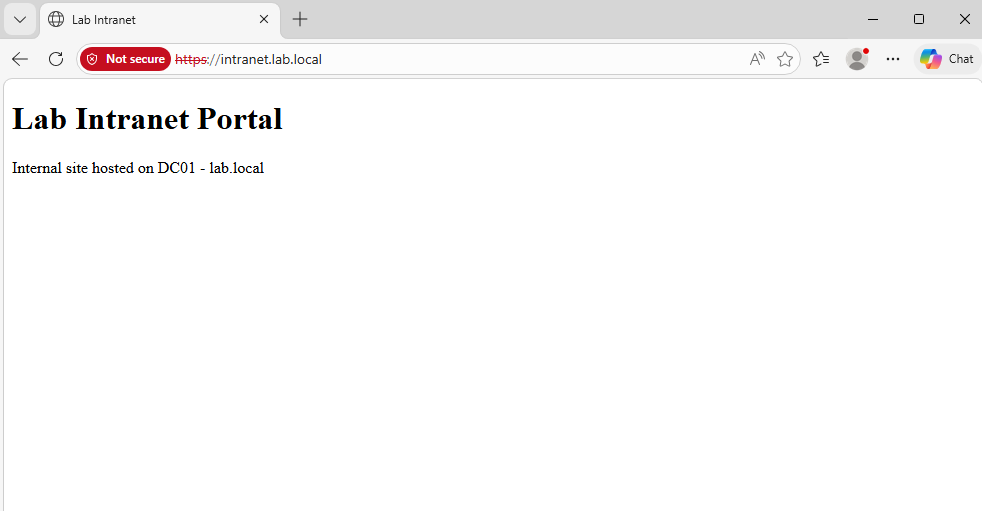 Service Unavailable
 
```powershell
Get-WebConfigurationProperty `
  -Filter "system.applicationHost/applicationPools/add[@name='DefaultAppPool']" `
  -PSPath "IIS:\" -Name state
 
Start-WebAppPool -Name "DefaultAppPool"
```
 
> **Note:** WAS event log queries return no results when the app pool was manually
> stopped rather than system-stopped. The state check above is sufficient for diagnosis.
 
---
 
## 9. Certificate Services with ADCS
 
### Install ADCS Role
 
```powershell
Install-WindowsFeature -Name ADCS-Cert-Authority, ADCS-Web-Enrollment `
  -IncludeManagementTools
```
 
### Configure Enterprise CA
 
```powershell
Install-AdcsCertificationAuthority `
  -CAType EnterpriseRootCA `
  -CACommonName "Lab-Root-CA" `
  -KeyLength 2048 `
  -HashAlgorithmName SHA256 `
  -ValidityPeriod Years `
  -ValidityPeriodUnits 5 `
  -Force
```
 
### Fix WebServer Template Permissions
 
Before requesting a certificate:
 
1. Run `certtmpl.msc`
2. Right-click **Web Server** > **Properties** > **Security** tab
3. Add **Authenticated Users** with Allow for Read and Enroll
4. Click Apply > OK
> **Note:** Adding Domain Admins or Domain Computers alone is insufficient.
> The template ACL requires Authenticated Users with Enroll permission.
> See [Issues and Lessons Learned](#13-issues--lessons-learned) for full history.
 
### Issue CA-Signed Certificate for IIS
 
```powershell
$cert = Get-Certificate `
  -Template "WebServer" `
  -DnsName "intranet.lab.local" `
  -CertStoreLocation "Cert:\LocalMachine\My"
```
 
### Replace Self-Signed Certificate on IIS
 
Always check binding info first:
 
```powershell
Get-WebBinding -Name "Intranet" | Select-Object protocol, bindingInformation
```
 
Then replace:
 
```powershell
Remove-WebBinding `
  -Name "Intranet" `
  -Protocol "https" `
  -Port 443 `
  -HostHeader "intranet.lab.local"
 
New-WebBinding `
  -Name "Intranet" `
  -Protocol "https" `
  -Port 443 `
  -HostHeader "intranet.lab.local" `
  -SslFlags 0
 
$thumbprint = $cert.Certificate.Thumbprint
$binding = Get-WebBinding -Name "Intranet" -Protocol "https"
$binding.AddSslCertificate($thumbprint, "My")
```
 
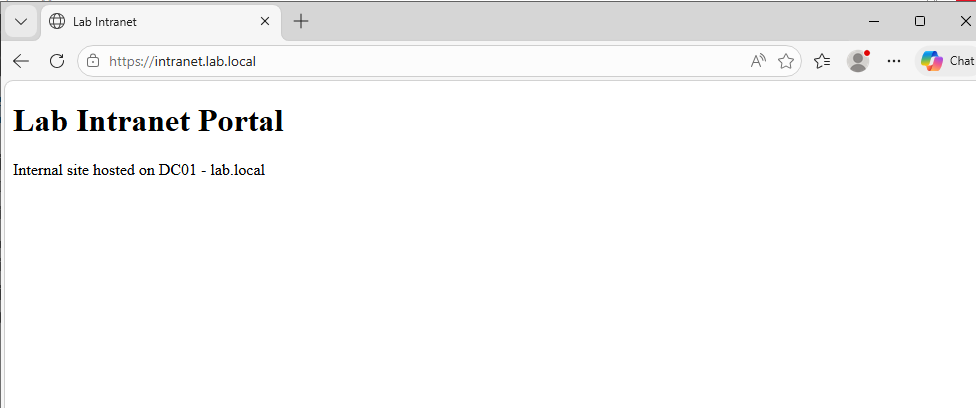
 
> **Note:** Remove-WebBinding requires the HostHeader parameter when the binding
> was created with a host header. Omitting it causes "Cannot find binding" errors.
 
### Certificate Revocation
 
> **Note:** ADCSAdministration PowerShell cmdlets did not function reliably in this
> environment. Use certutil instead -- it is more universally reliable and is what
> most experienced admins use in production.
 
```powershell
# View issued certificates via certsrv.msc > Issued Certificates
# Copy the serial number, then revoke:
certutil -revoke "<SerialNumber>" 4
 
# Reason codes: 0=Unspecified 1=Key Compromise 2=CA Compromise
# 3=Affiliation Changed 4=Superseded 5=Cessation of Operation
 
# Publish updated CRL
certutil -crl
```
 
Verify in `certsrv.msc` > Revoked Certificates.
 
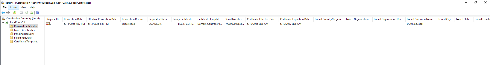
 
---
 
## 10. Microsoft Entra ID
 
> **Tenant Setup Note:** Multiple tenant creation attempts were required during this
> lab. Key lessons:
> - Always verify tenant type is Workforce before proceeding. External ID tenants
>   block standard user sign-ins with error AADSTS500208.
> - Conditional Access requires Microsoft Entra ID P1 or P2. Activate a free P2
>   trial before attempting to create policies.
> - The P2 trial must be activated on the same tenant where Conditional Access
>   will be configured.
>
> See [Issues and Lessons Learned](#13-issues--lessons-learned) for full details.
 
### Create Test User
 
```powershell
Install-Module Microsoft.Graph -Scope CurrentUser
Connect-MgGraph -Scopes "User.ReadWrite.All", "Group.ReadWrite.All"
 
New-MgUser `
  -DisplayName "Test User" `
  -UserPrincipalName "testuser@<tenant>.onmicrosoft.com" `
  -MailNickname "testuser" `
  -AccountEnabled `
  -PasswordProfile @{
    Password                      = "TempPass@2024!"
    ForceChangePasswordNextSignIn = $true
  }
```
 
### Enable MFA
 
```
entra.microsoft.com > Users > Per-user MFA > Select user > Enable MFA
```
 
Verified by signing into myapps.microsoft.com and registering Microsoft Authenticator.
 


 
### Conditional Access Policy
 
```
entra.microsoft.com > Security > Conditional Access > New Policy:
  Name: Require MFA - All Users
  Users: All users (exclude break-glass admin account)
  Cloud apps: All cloud apps
  Grant: Require multi-factor authentication
  Policy state: Report-only
```
 
### Verify Sign-In Logs
 
Sign in as test user at myapps.microsoft.com in an InPrivate window. In sign-in logs:
 
- **Not Applied** -- policy not in enforcement mode, expected behavior in report-only
- **Report-only: Success** -- policy evaluated correctly and would require MFA if enforced
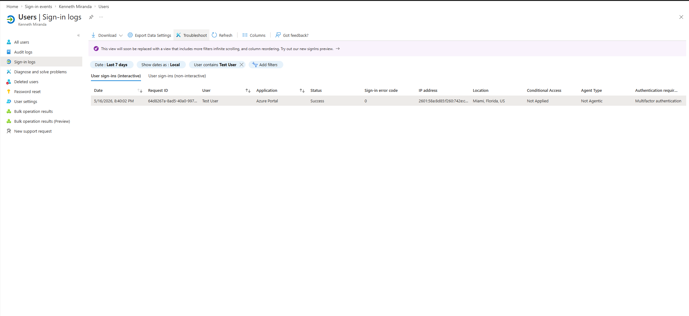
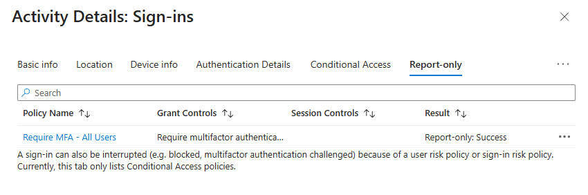
 
> This is the correct way to test Conditional Access. Report-only first confirms
> expected behavior before enforcement. Enabling enforcement without testing risks
> locking users out including the admin account.
 
> **Azure Cleanup Reminder:** After completing Sections 10 and 11, immediately clean
> up all Azure resources to avoid charges after your free trial expires:
> 1. Delete Log Analytics workspace
> 2. Delete resource group (removes everything inside)
> 3. Cancel P2 trial: entra.microsoft.com > Billing > Licenses > Cancel
> 4. Cancel Azure subscription: portal.azure.com > Subscriptions > Cancel
> 5. Verify portal.azure.com > All resources is completely empty
> 6. Remove credit card: Cost Management + Billing > Payment methods
 
---
 
## 11. Cloud Monitoring with Azure Monitor & Log Analytics
 
### Create Log Analytics Workspace
 
```
portal.azure.com > Log Analytics workspaces > Create:
  Resource group: lab-monitoring-rg (new)
  Name: lab-log-analytics
  Region: East US
```
 
### Connect Entra ID Logs
 
```
entra.microsoft.com > Monitoring & health > Diagnostic settings >
  Add diagnostic setting:
    Logs: AuditLogs, SignInLogs, NonInteractiveUserSignInLogs, RiskyUsers
    Destination: Send to Log Analytics workspace > lab-log-analytics
```
 
Allow 15-30 minutes for logs to begin flowing. Generate sign-in activity before querying.
 
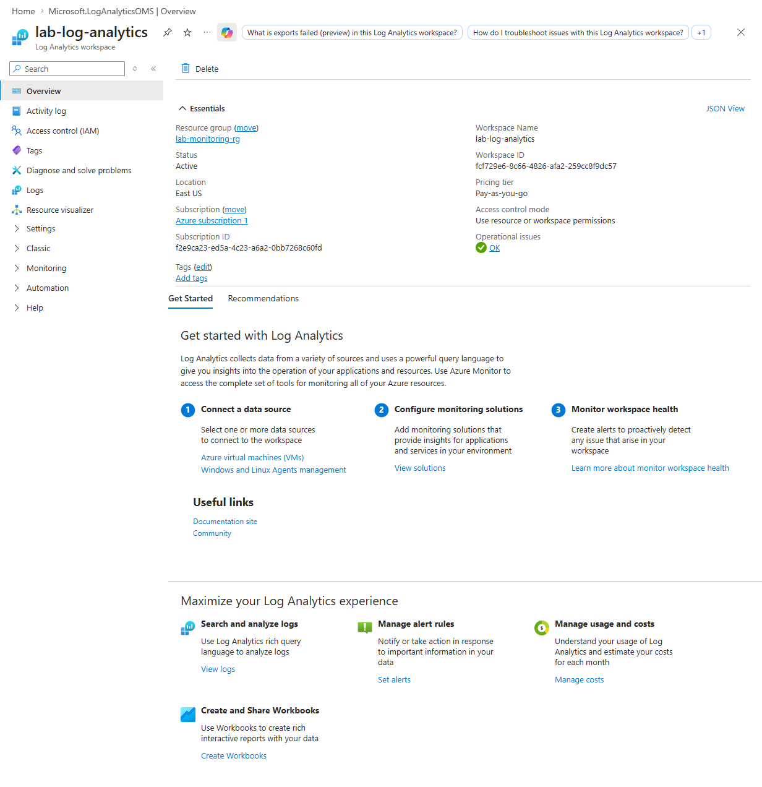
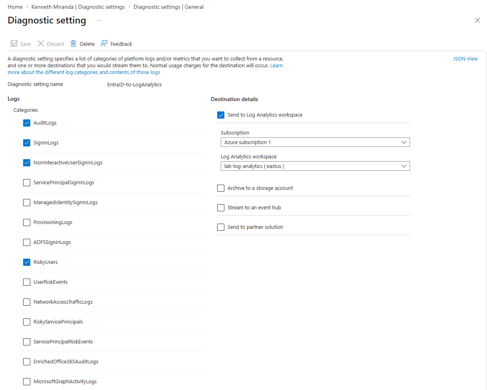
 
### Verify Table Names Before Querying
 
```kql
search *
| distinct $table
| sort by $table asc
```
 
> **Note:** The table name is `SigninLogs` (lowercase i), not `SignInLogs`.
> KQL table names are case sensitive -- always verify exact names first.
 
### KQL Queries
 
**All sign-ins in the last 24 hours:**
 
```kql
SigninLogs
| where TimeGenerated > ago(24h)
| project TimeGenerated, UserPrincipalName, ResultType,
    ResultDescription, IPAddress, AppDisplayName
| order by TimeGenerated desc
```
 
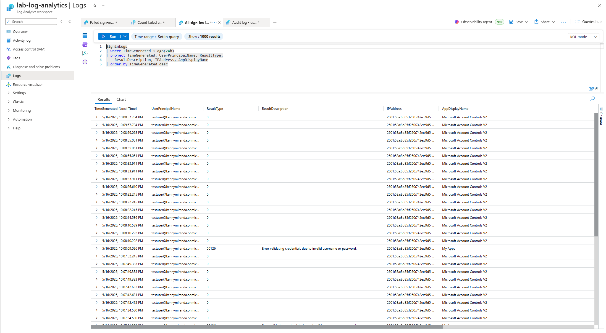
 
**Failed sign-ins only:**
 
```kql
SigninLogs
| where TimeGenerated > ago(24h)
| where ResultType != "0"
| project TimeGenerated, UserPrincipalName, ResultType,
    ResultDescription, IPAddress, Location
| order by TimeGenerated desc
```
 
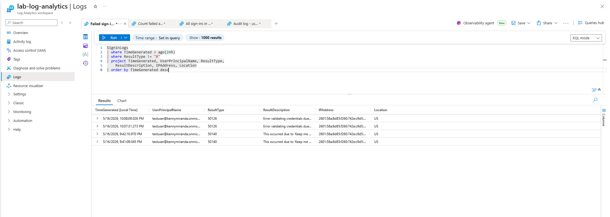
 
**Brute force detection:**
 
```kql
SigninLogs
| where TimeGenerated > ago(1h)
| where ResultType != "0"
| summarize FailedAttempts = count() by UserPrincipalName, IPAddress
| where FailedAttempts > 2
| order by FailedAttempts desc
```
 
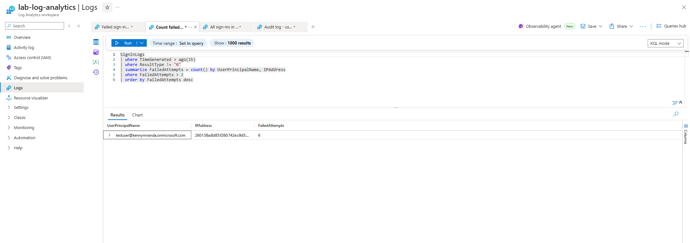
 
**Audit log -- management changes:**
 
```kql
AuditLogs
| where TimeGenerated > ago(7d)
| where Category == "GroupManagement"
| project TimeGenerated, OperationName, Result,
    InitiatedBy, TargetResources
| order by TimeGenerated desc
```
 
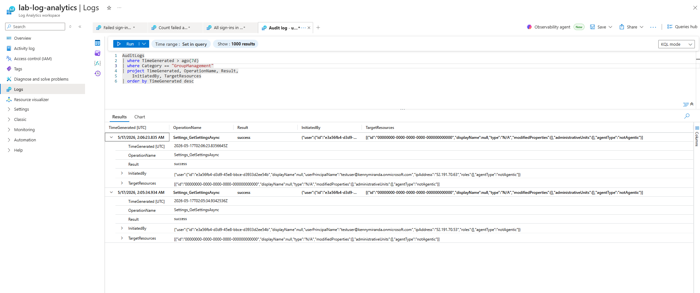
 
> **Note:** AuditLogs Category values vary by tenant activity. Run
> `AuditLogs | distinct Category` first to find available categories.
> "UserManagement" may not exist if no user management operations have been logged.
 
### ResultType Reference
 
| Code  | Meaning                      |
|-------|------------------------------|
| 0     | Success                      |
| 50126 | Invalid username or password |
| 50076 | MFA required                 |
| 53003 | Conditional Access block     |
 
### Alert Rule -- Brute Force Detection
 
```
portal.azure.com > Log Analytics workspace > Alerts > New alert rule:
  Condition -- Custom log search:
    SigninLogs
    | where TimeGenerated > ago(10m)
    | where ResultType != "0"
    | summarize FailedAttempts = count() by UserPrincipalName
    | where FailedAttempts > 5
  Alert logic: Greater than 0
  Evaluation: Every 5 minutes, Lookback 10 minutes
  Severity: 2 - Warning
  Name: Brute Force Detection - Failed Sign-Ins
```
 
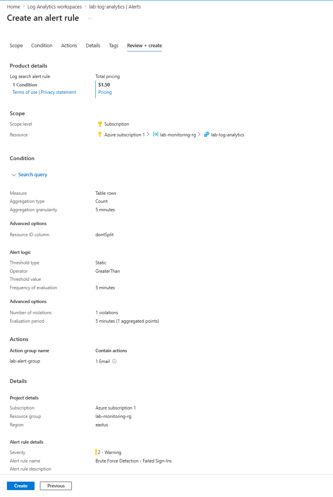
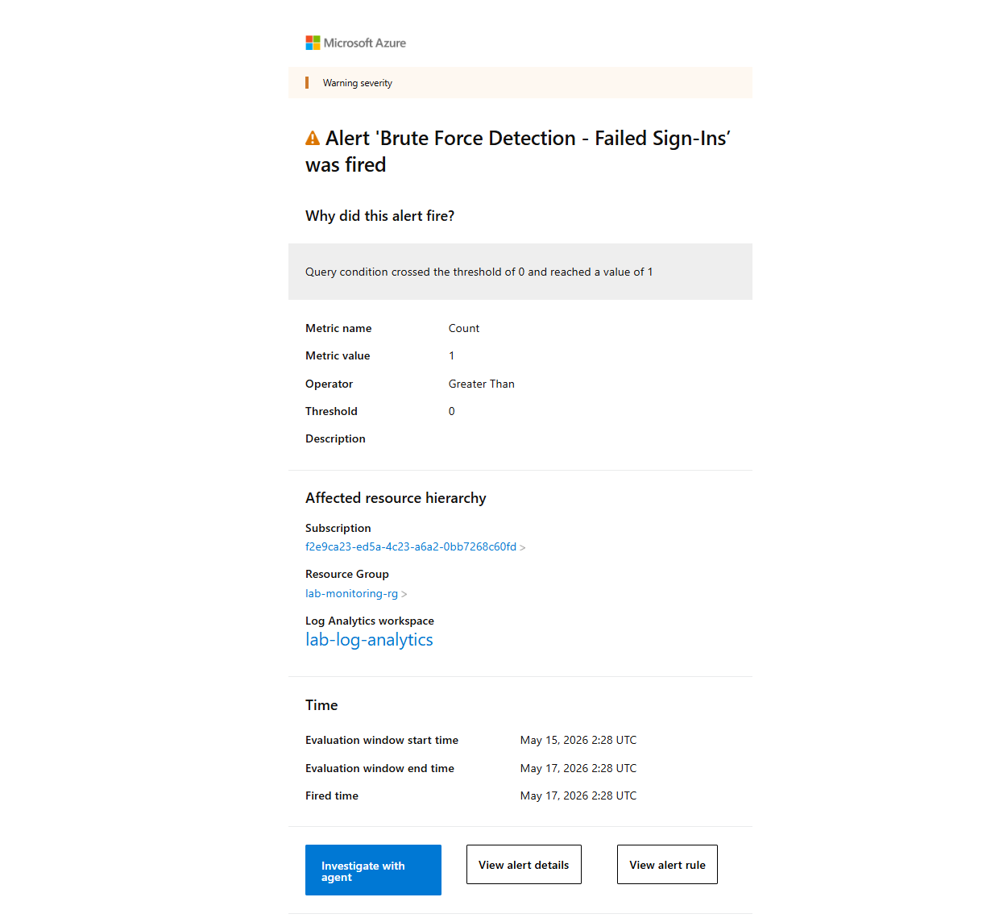
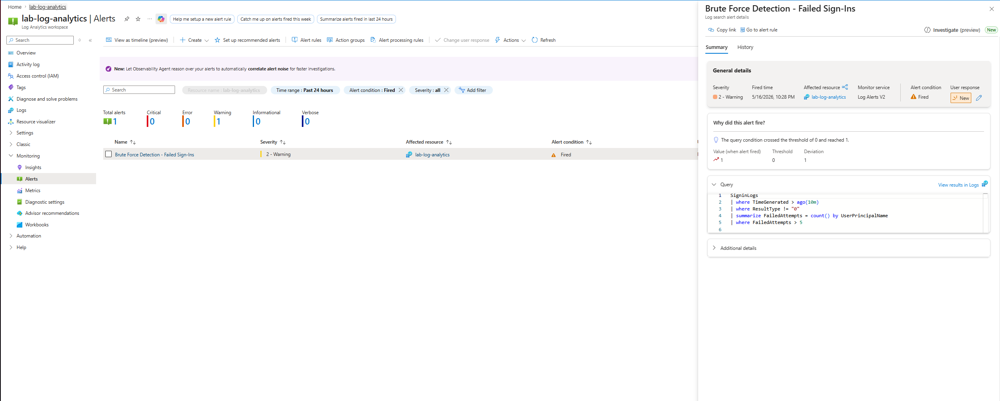
 
### Investigation Simulation
 
1. Fail login as testuser 6-7 times at myapps.microsoft.com
2. Wait 15 minutes for Log Analytics ingestion
3. Run brute force detection query -- confirms user and attempt count
4. Run failed sign-ins query -- shows individual ResultType codes per event
5. Run audit log query -- confirms no account changes in the same window
> The brute force query summarizes into one row per user showing only the count.
> Run the raw failed sign-ins query separately to see individual ResultType codes.
> ResultType 50126 confirms wrong password rather than a more serious incident.
 
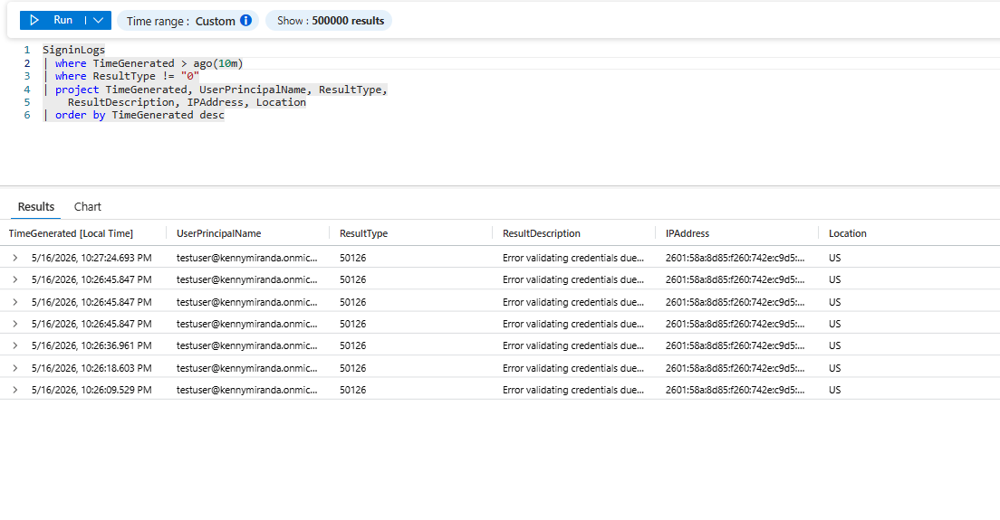
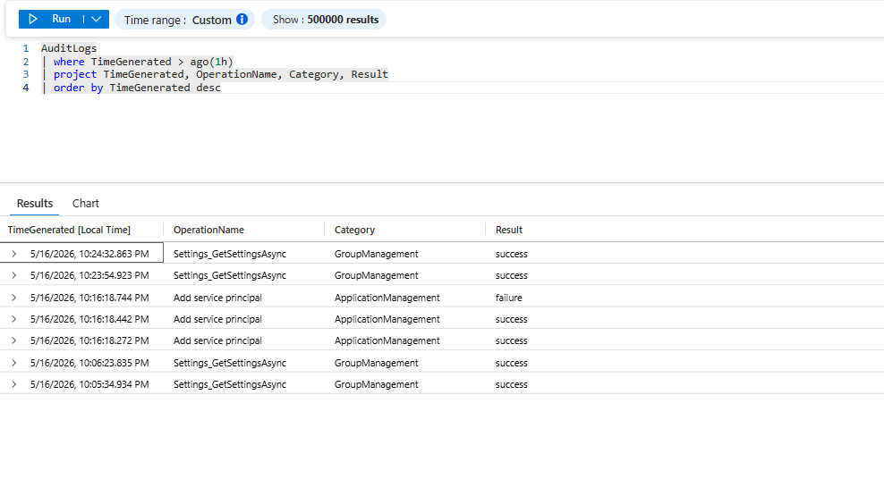
 
---
 
## 12. Troubleshooting Scenarios
 
### Scenario A -- GPO Not Applying
 
**Break it:**
 
```powershell
Get-ADComputer "WIN11-CLIENT" | Move-ADObject `
  -TargetPath "CN=Computers,DC=lab,DC=local"
```
 
**Diagnose:**
 
```powershell
gpresult /r /scope computer
```
 
GPOs will be absent from Applied Group Policy Objects.
 
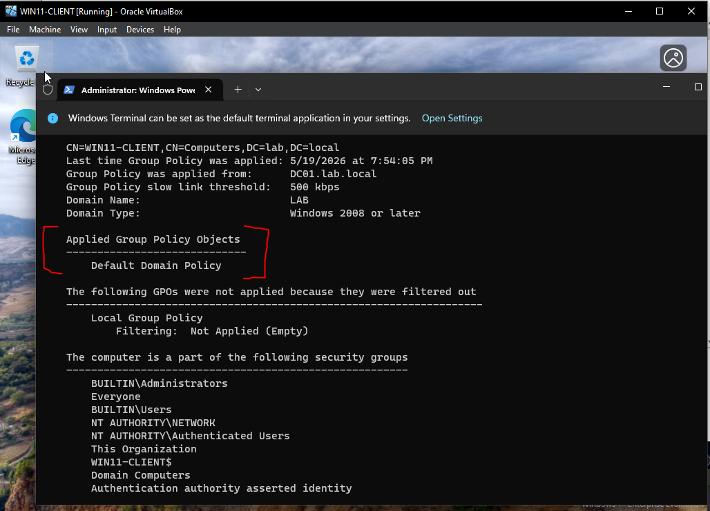
 
**Fix it:**
 
```powershell
# On DC
Get-ADComputer "WIN11-CLIENT" | Move-ADObject `
  -TargetPath "OU=Workstations,OU=Computers,OU=Corp,DC=lab,DC=local"
```
 
```powershell
# On client
gpupdate /force
gpresult /r /scope computer
```
 
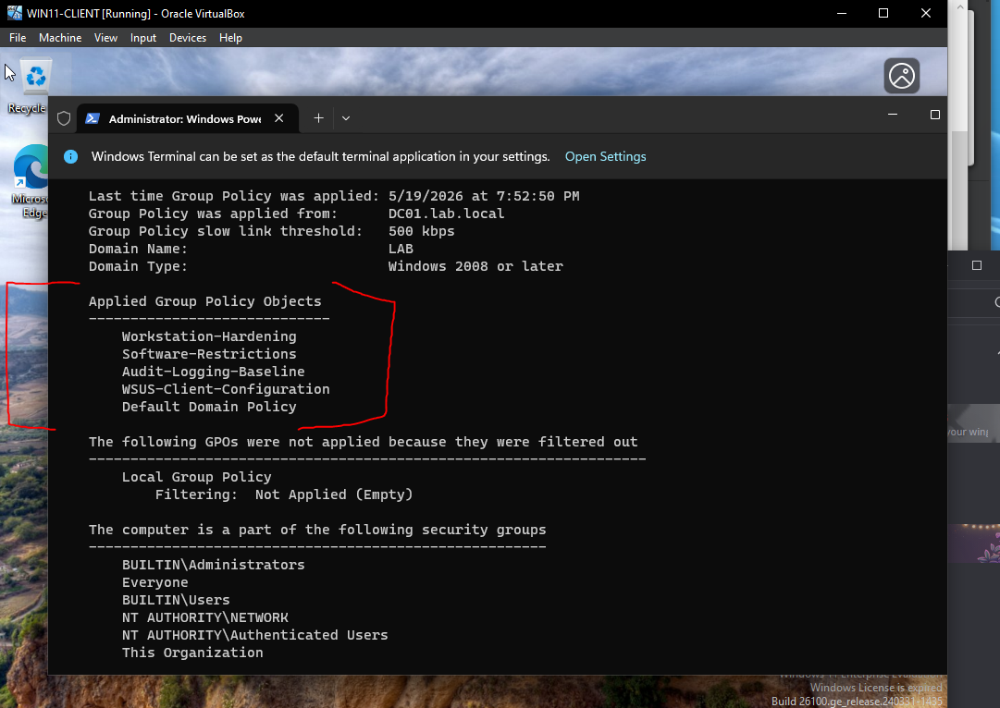
 
> **Note:** Always use `gpresult /r /scope computer` not `gpresult /r` when running
> elevated as a different account than the logged-in user.
 
### Scenario B -- Account Lockout
 
**Break it:** Log in as `LAB\jcarter` with the wrong password 6 times.
 
**Diagnose:**
 
```powershell
Get-ADUser "jcarter" -Properties LockedOut, BadLogonCount, BadPasswordTime |
  Select-Object Name, LockedOut, BadLogonCount
 
Get-WinEvent -FilterHashtable @{ LogName = 'Security'; Id = 4740 } |
  Select-Object TimeCreated, Message | Format-List
```
 
Event ID 4740 shows which machine triggered the lockout.
 
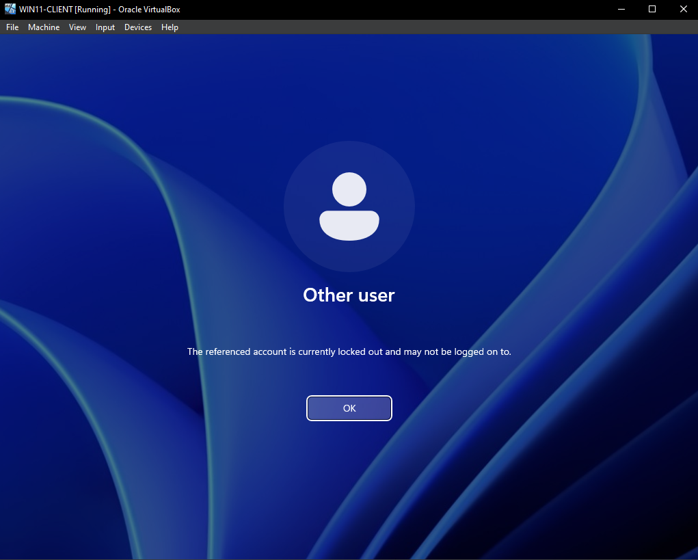
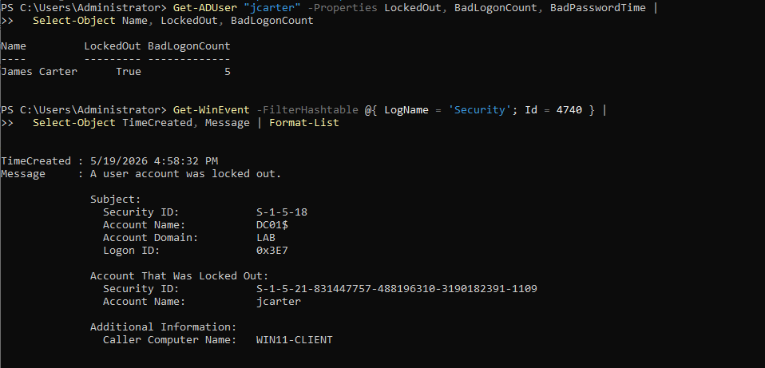
 
**Fix it:**
 
```powershell
Unlock-ADAccount -Identity "jcarter"
 
Get-ADUser "jcarter" -Properties LockedOut |
  Select-Object Name, LockedOut
```
 
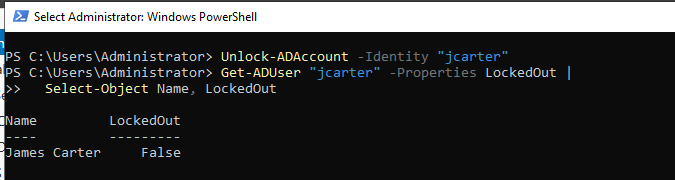
 
### Scenario C -- IIS App Pool Stops
 
**Break it:**
 
```powershell
Stop-WebAppPool -Name "DefaultAppPool"
```
 
Browse to `http://intranet.lab.local` -- returns 503.
 
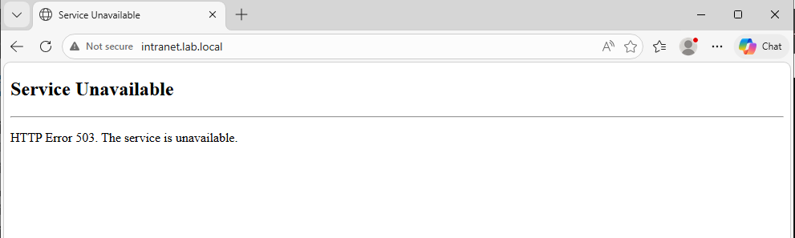
 
**Diagnose:**
 
```powershell
Get-WebConfigurationProperty `
  -Filter "system.applicationHost/applicationPools/add[@name='DefaultAppPool']" `
  -PSPath "IIS:\" -Name state
```
 
> **Note:** WAS event log queries return no results for manually stopped pools.
> The state check above is sufficient for diagnosis.
 
**Fix it:**
 
```powershell
Start-WebAppPool -Name "DefaultAppPool"
 
Invoke-WebRequest -Uri "http://intranet.lab.local" -UseBasicParsing |
  Select-Object StatusCode
```
 
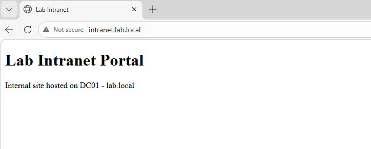
 
### Scenario D -- DNS Misconfiguration
 
**Break it:**
 
```powershell
# Find correct adapter names first
Get-NetAdapter
 
Set-DnsClientServerAddress -InterfaceAlias "Ethernet" -ServerAddresses 8.8.8.8
Set-DnsClientServerAddress -InterfaceAlias "Ethernet 2" -ServerAddresses 8.8.8.8
ipconfig /flushdns
```
 
**Diagnose:**
 
```powershell
Resolve-DnsName intranet.lab.local -Verbose
Get-DnsClientServerAddress | Select-Object InterfaceAlias, ServerAddresses
Test-NetConnection -ComputerName DC01 -Port 53
```
 
**Fix it:**
 
```powershell
Set-DnsClientServerAddress -InterfaceAlias "Ethernet" -ServerAddresses 192.168.56.10
Set-DnsClientServerAddress -InterfaceAlias "Ethernet 2" -ServerAddresses 192.168.56.10
ipconfig /flushdns
Resolve-DnsName intranet.lab.local
```
 
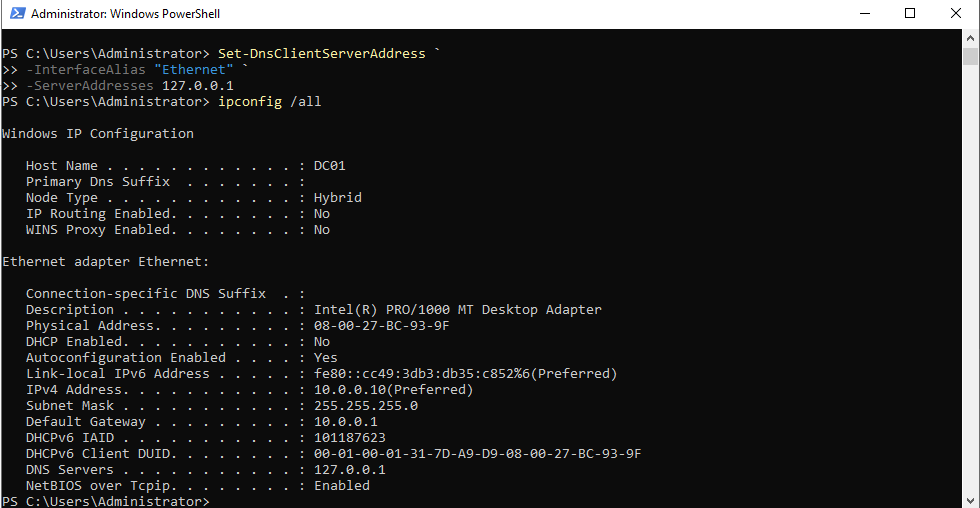
 
> **Lab Note:** In this VirtualBox environment the site remained accessible after
> DNS was changed due to VirtualBox NAT assigning IP 10.0.0.10 to the client,
> combined with IIS wildcard binding. Resolve-DnsName -Verbose revealed the
> unexpected resolution target. This mirrors a real-world DNS anomaly scenario --
> split-brain DNS, stale records, or unexpected resolution paths that require
> verifying which server answered and what IP resolved, not just whether
> resolution succeeded.
 
---
 
## 13. Issues & Lessons Learned
 
All issues encountered during the lab build, documented in order with root cause
and resolution. Included as a reference for anyone following this lab.
 
---
 
### Issue 1 -- Provisioning Script Cannot Be Pasted Into PowerShell Terminal
 
**Symptom:** Errors or incorrect behavior when pasting the script interactively.
 
**Root Cause:** Multi-line scripts with loops and hashtables need to be saved as
a .ps1 file and executed, not run interactively.
 
**Resolution:** Save as `C:\Scripts\provision-users.ps1` then:
 
```powershell
Set-ExecutionPolicy RemoteSigned -Force
C:\Scripts\provision-users.ps1
```
 
Run as two separate commands.
 
---
 
### Issue 2 -- Set-ExecutionPolicy Parameter Binding Error
 
**Symptom:** `Cannot bind parameter 'Scope'. Cannot convert value C:\Scripts\...`
 
**Root Cause:** Both commands pasted on one line.
 
**Resolution:** Run each command separately, pressing Enter after each.
 
---
 
### Issue 3 -- Provisioning Script String Terminator Error
 
**Symptom:** Parser errors pointing to the Write-Warning line.
 
**Root Cause:** Em dash (---) corrupted to garbled characters during copy-paste,
breaking the string literal.
 
**Resolution:**
 
```powershell
(Get-Content C:\Scripts\provision-users.ps1) -replace 'â€"', '-' |
  Set-Content C:\Scripts\provision-users.ps1
```
 
Or open in Notepad and replace with a plain hyphen.
 
---
 
### Issue 4 -- GPO Setting Not Found Under Computer Configuration
 
**Symptom:** "Prevent access to registry editing tools" missing from
`Computer Configuration > Administrative Templates > System`
 
**Root Cause:** Setting is under User Configuration, not Computer Configuration.
 
**Resolution:** Navigate to `User Configuration > Administrative Templates > System`
 
---
 
### Issue 5 -- Windows 11 VM Boots to Black Screen
 
**Symptom:** VM shows Running but screen is completely black.
 
**Root Cause:** EFI not enabled in VirtualBox VM settings.
 
**Resolution:**
1. Enable EFI: Settings > System > Motherboard > Enable EFI
2. Confirm ISO mounted in Settings > Storage
3. Start VM and immediately press any key repeatedly
If EFI shell appears, type: `FS0:\EFI\BOOT\BOOTX64.EFI`
 
---
 
### Issue 6 -- Windows 11 Installer Blocks on TPM 2.0 Requirement
 
**Symptom:** Installer shows TPM/Secure Boot required, only Back and Close available.
 
**Resolution:**
 
1. Press Shift+F10 > type `regedit` > Enter
2. Navigate to `HKEY_LOCAL_MACHINE\SYSTEM\Setup`
3. Create key `LabConfig`
4. Add three DWORD values all set to 1:
   - `BypassTPMCheck`
   - `BypassSecureBootCheck`
   - `BypassRAMCheck`
5. Close Registry Editor > click Back then Next
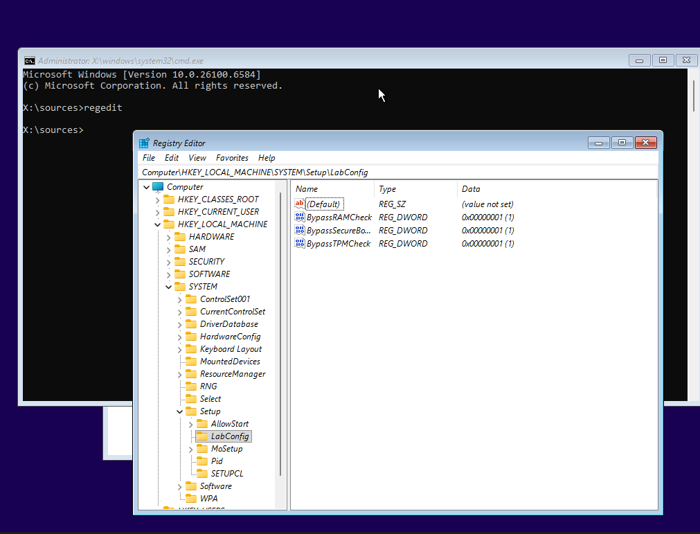
 
---
 
### Issue 7 -- Get-ADComputer Cannot Find WIN11-CLIENT
 
**Symptom:** `Cannot find an object with identity: 'WIN11-CLIENT'`
 
**Root Cause:** Windows 11 registered in AD under auto-generated name (DESKTOP-XXXXXXX).
 
**Resolution:**
 
```powershell
Get-ADComputer -Filter * | Select-Object Name
 
Get-ADComputer "DESKTOP-XXXXXXX" | Move-ADObject `
  -TargetPath "OU=Workstations,OU=Computers,OU=Corp,DC=lab,DC=local"
 
Rename-Computer -NewName "WIN11-CLIENT" -DomainCredential (Get-Credential) -Restart
```
 
---
 
### Issue 8 -- gpresult Shows N/A or Missing Computer Settings
 
**Symptom:** N/A under Applied Group Policy Objects, or "LAB\Administrator does
not have RSoP data"
 
**Root Cause:** gpresult run without Administrator privileges, or account context
mismatch when elevated under a different account than the logged-in user.
 
**Resolution:**
 
```powershell
gpresult /r /scope computer
```
 
---
 
### Issue 9 -- WSUS Initial Sync Fails With DNS Resolution Error
 
**Symptom:** `The remote name could not be resolved: sws.update.microsoft.com`
 
**Root Cause:** DC01 on Internal Network only with no internet access.
 
**Resolution:** Add NAT adapter to DC01:
VirtualBox > Settings > Network > Adapter 2 > Enable > Attached to: NAT
 
---
 
### Issue 10 -- WSUS Console Cannot Connect to DC01 on Port 8530
 
**Symptom:** "Cannot connect to DC01. Please verify IIS is configured and running."
 
**Root Cause:** IIS (W3SVC service) was not running.
 
**Resolution:**
 
```powershell
Start-Service W3SVC
Set-Service W3SVC -StartupType Automatic
```
 
Then connect: right-click Update Services > Connect to Server > DC01, port 8530.
 
---
 
### Issue 11 -- WSUS Console Times Out Despite All Services Running
 
**Symptom:** Remote API timeout. All three services show Running.
 
**Root Cause:** Insufficient VM RAM. DC01 running multiple roles on 2 GB caused
WsusPool to crash under memory pressure.
 
**Resolution:**
 
```powershell
Set-WebConfigurationProperty `
  -Filter "system.applicationHost/applicationPools/add[@name='WsusPool']/recycling/periodicRestart" `
  -PSPath "IIS:\" -Name privateMemory -Value 0
 
Restart-WebAppPool -Name "WsusPool"
```
 
Then increase DC01 RAM to at least 4096 MB in VirtualBox settings.
 
**Lesson:** Allocate 4+ GB to DC01 from the start when running multiple server roles.
 
---
 
### Issue 12 -- Windows Server 2022 Not in WSUS Product List
 
**Symptom:** Product list shows only legacy entries, no Server 2022.
 
**Root Cause:** Server 2022 is not a standalone WSUS product. It is covered
under "Windows Server 2019 and later" categories.
 
**Resolution:** Select "Windows Server 2019 and later, Servicing Drivers" instead.
 
---
 
### Issue 13 -- WIN11-CLIENT Not Appearing in WSUS Console
 
**Symptom:** Client does not appear despite correct configuration on all fronts.
 
**Root Cause:** Known Windows 11 and WSUS compatibility issue. Microsoft has shifted
Windows 11 toward Windows Update for Business and Intune.
 
**Resolution:** No resolution found in lab environment. In production this is handled
through Intune -- consistent with Microsoft's current enterprise direction.
 
---
 
### Issue 14 -- WebServer Template Certificate Enrollment Denied
 
**Symptom:** `CERTSRV_E_TEMPLATE_DENIED 0x80094012`
 
**Steps that did not fix it:**
- Adding Domain Computers with Enroll in certtmpl.msc
- Adding Domain Admins with Enroll in certtmpl.msc
- Adding Domain Admins with Request Certificates in certsrv.msc
**Root Cause:** Default WebServer template does not grant Authenticated Users
enroll permission. Template ACL was the blocking layer.
 
**Resolution:** In certtmpl.msc > Web Server > Properties > Security:
Add **Authenticated Users** with Allow for Read and Enroll.
 
---
 
### Issue 15 -- Remove-WebBinding Cannot Find Binding
 
**Symptom:** `Cannot find binding '*:443:*'`
 
**Root Cause:** Remove-WebBinding requires HostHeader parameter when the binding
was created with a host header. Omitting it causes a wildcard mismatch.
 
**Resolution:** Always check binding info first, then include HostHeader:
 
```powershell
Get-WebBinding -Name "Intranet" | Select-Object protocol, bindingInformation
 
Remove-WebBinding -Name "Intranet" -Protocol "https" -Port 443 `
  -HostHeader "intranet.lab.local"
```
 
---
 
### Issue 16 -- ADCSAdministration Module Cmdlets Not Recognized
 
**Symptom:** Get-CACertificate and Revoke-CACertificate not recognized even after
Import-Module ADCSAdministration.
 
**Root Cause:** Module cmdlets did not function correctly in this environment
despite importing without error.
 
**Resolution:** Use certutil instead:
 
```powershell
certutil -revoke "<SerialNumber>" 4
certutil -crl
```
 
Verify in certsrv.msc > Revoked Certificates.
 
**Lesson:** certutil is more reliable than the PowerShell wrappers and is what
most experienced admins use in production environments.
 
---
 
### Issue 17 -- Entra ID External vs Workforce Tenant
 
**Symptom:** Test user sign-in fails with AADSTS500208.
 
**Root Cause:** Tenant created as External ID type instead of Workforce.
External ID tenants block standard workforce user sign-ins.
 
**Resolution:** Create a new Workforce tenant at entra.microsoft.com.
Verify tenant type under Overview shows Workforce, not External.
 
---
 
### Issue 18 -- Conditional Access Requires Premium License
 
**Symptom:** Conditional Access policy creation blocked by licensing requirement.
 
**Resolution:** Activate Microsoft Entra ID P2 free trial:
entra.microsoft.com > Billing > Licenses > Try/Buy > Microsoft Entra ID P2
 
Trial must be activated on the same tenant where Conditional Access will be used.
 
---
 
### Issue 19 -- SignInLogs Table Name Capitalization
 
**Symptom:** KQL query fails with SEM0100 semantic error.
 
**Root Cause:** Table is `SigninLogs` not `SignInLogs`. KQL is case sensitive.
 
**Resolution:** Run `search * | distinct $table` to verify exact table names.
 
---
 
### Issue 20 -- AuditLogs Category Value Differs From Expected
 
**Symptom:** `where Category == "UserManagement"` returns no results.
 
**Root Cause:** Category values depend on what activity has occurred in the tenant.
 
**Resolution:**
 
```kql
AuditLogs
| distinct Category
```
 
Find available categories then filter accordingly.
 
---
 
### Issue 21 -- Scenario D DNS Break Not Fully Demonstrable in VirtualBox
 
**Symptom:** intranet.lab.local remained accessible after changing DNS to 8.8.8.8.
 
**Root Cause:** VirtualBox NAT assigned IP 10.0.0.10 to the client. IIS wildcard
binding caught requests on that IP, causing loopback behavior.
 
**Finding:** `Resolve-DnsName intranet.lab.local -Verbose` revealed resolution
to 10.0.0.10 rather than DC01's 192.168.56.10.
 
**Lesson:** Multiple resolution layers can mask DNS changes. Always verify which
server answered and what IP resolved -- not just whether resolution succeeded.
This mirrors real-world split-brain DNS and DNS hijacking investigation workflows.
 
---
 
## Tools Used
 
| Tool                     | Purpose                                                          |
|--------------------------|------------------------------------------------------------------|
| ADUC                     | GUI-based user, group, and OU management                         |
| PowerShell AD module     | Bulk provisioning, querying, and automation                      |
| GPMC                     | GPO creation, linking, and reporting                             |
| gpresult /scope computer | Verify applied GPOs -- always use /scope computer when elevated  |
| gpupdate                 | Force policy refresh                                             |
| Event Viewer             | Diagnose GPO failures, logon events, lockouts, DNS errors        |
| Get-WinEvent             | PowerShell-based event log querying                              |
| Get-ADUser / Get-ADGroup | AD object inspection and membership verification                 |
| Test-NetConnection       | Port and connectivity testing                                    |
| Resolve-DnsName -Verbose | DNS resolution testing with answering server identification      |
| Get-Acl / Get-SmbShare   | NTFS and share permission inspection                             |
| WSUS Console             | Patch approval, computer groups, compliance reporting            |
| WsusUtil.exe             | WSUS post-install configuration                                  |
| IIS Manager              | Web site and application pool administration                     |
| WebAdministration module | PowerShell-based IIS configuration                               |
| certtmpl.msc             | Certificate template permission management                       |
| certsrv.msc              | CA management, certificate issuance and revocation               |
| certutil                 | Certificate operations, CRL publishing, CA diagnostics           |
| Microsoft Entra ID       | Cloud identity, MFA, and Conditional Access                      |
| Microsoft Graph PS       | Cloud user and group management via PowerShell                   |
| Azure Monitor            | Cloud-based infrastructure and identity monitoring               |
| Log Analytics / KQL      | Log aggregation, querying, and alert rule configuration          |
 
---
 
[](mailto:kennymiranda000@gmail.com)
[](https://linkedin.com/in/kenneth-miranda-xyz)
